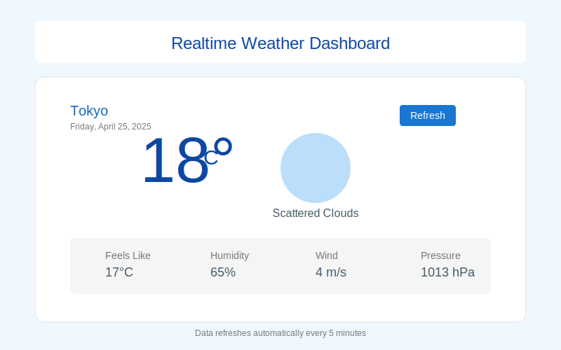

# Realtime Weather Dashboard

A Vue.js application that displays real-time weather data and forecasts.



## Screenshots

### Login Page


### Dashboard


## Features

- Current weather conditions display
- Multi-day weather forecast
- Real-time updates
- Responsive design for all devices
- Location-based weather data
- Intuitive weather visualization

## Project Setup

### Prerequisites

- [Node.js](https://nodejs.org/) (v14 or higher)
- [pnpm](https://pnpm.io/) (v6 or higher)
- Weather API key (from OpenWeatherMap or similar service)

### Installation

1. Clone the repository:
   ```bash
   git clone https://github.com/hanksudo/realtime-weather.git
   cd realtime-weather
   ```

2. Install dependencies:
   ```bash
   pnpm install
   ```

3. Create a `.env` file in the root directory with your API key:
   ```
   VITE_WEATHER_API_KEY=your_api_key_here
   ```

4. Run the development server:
   ```bash
   pnpm dev
   ```

5. Open your browser and navigate to `http://localhost:3000`

## Usage

- The dashboard automatically loads weather data for your current location
- Use the search bar to look up weather in other locations
- Toggle between current conditions and forecast views
- Weather data updates automatically in real-time

## Build for Production

```bash
pnpm build
```

This will generate a production-ready build in the `dist` directory.

## Technologies Used

- Vue.js 3
- Vue Router
- Axios for API requests
- Socket.io for real-time updates
- date-fns for date formatting
- Vite
- pnpm
