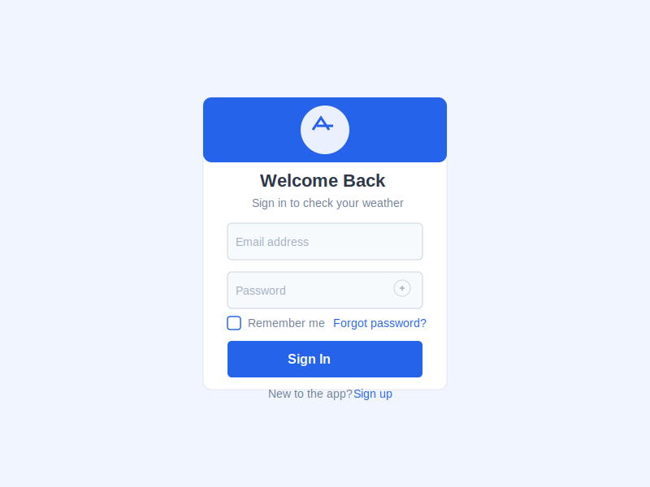
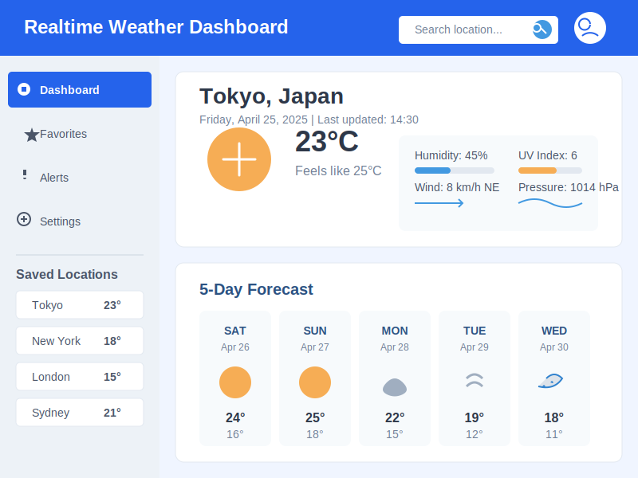

# Vue.js Login Demo

A simple login page demo built with Vue.js and pnpm.

## Screenshots

### Login Page


### Dashboard


## Features

- Login form with validation
- Simple authentication flow
- Responsive design
- Vue Router for navigation

## Project Setup

### Prerequisites

- [Node.js](https://nodejs.org/) (v14 or higher)
- [pnpm](https://pnpm.io/) (v6 or higher)

### Installation

1. Clone the repository:
   ```bash
   git clone https://github.com/hanksudo/vue-login-demo.git
   cd vue-login-demo
   ```

2. Install dependencies:
   ```bash
   pnpm install
   ```

3. Run the development server:
   ```bash
   pnpm dev
   ```

4. Open your browser and navigate to `http://localhost:3000`

## Usage

- Navigate to the login page (default route)
- Use any username with the password "password" to log in
- After successful login, you'll be redirected to the dashboard
- Click the logout button to return to the login page

## Build for Production

```bash
pnpm build
```

This will generate a production-ready build in the `dist` directory.

## Technologies Used

- Vue.js 3
- Vue Router
- Vite
- pnpm
